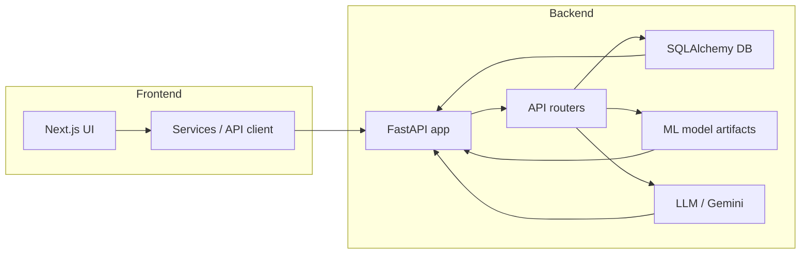
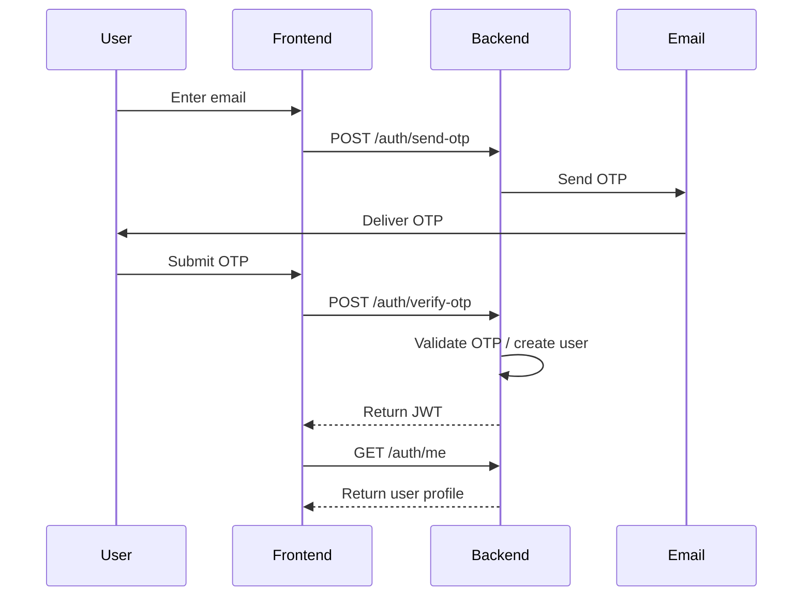
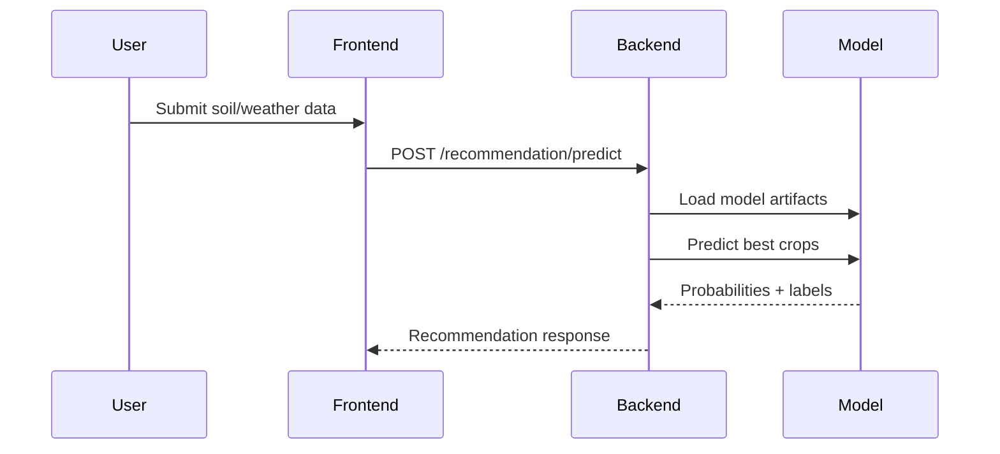
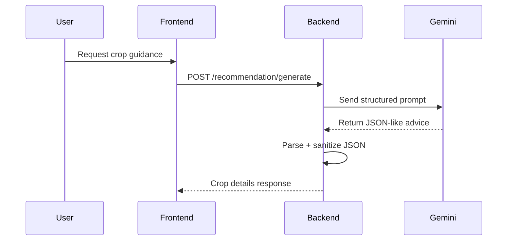

# Agrilink Project Overview

## 1. Introduction

Agrilink is a full-stack agriculture platform built as a monorepo. It combines:

- `backend/`: a Python FastAPI service for authentication, crop marketplace, recommendation, weather, mandi pricing, and analytics
- `frontend/`: a Next.js + React application for the user interface and role-based farmer/buyer flows
- ML + AI components: crop recommendation model, dataset enrichment, and language model crop guidance

The goal is to support farmers and buyers with smart crop selection, crop listings, weather data, and actionable crop care advice.

---

## 2. High-Level Architecture

### Backend

The backend is implemented in `backend/app/`.

- `main.py`: FastAPI application launcher
- `api/`: all REST API routers
- `config/database.py`: SQLAlchemy engine and session factory
- `core/settings.py`: environment configuration using `pydantic-settings`
- `core/security.py`: OTP generation, JWT creation, and email sending
- `models/`: SQLAlchemy ORM models
- `schemas/`: Pydantic request/response validation schemas
- `services/`: dataset enrichment, model artifacts, and ML/AI utilities

### Frontend

The frontend lives in `frontend/` and is built with:

- Next.js 15
- React 19
- Tailwind CSS
- axios
- @tanstack/react-query
- react-hook-form
- zod

Frontend service wrappers are in `frontend/src/services/`, including `recommendationService.tsx`.

### Data and AI

The project uses two AI layers:

- ML-based crop recommendation using saved model artifacts in `backend/app/services/data/`
- LLM-based crop care guidance using Google Gemini via `google.generativeai`

### Database

The backend uses SQLAlchemy with a database URL configured in `.env` via `DATABASE_URL`.

### Authentication

Authentication uses:

- email OTP workflow
- in-memory OTP storage in `backend/app/api/users.py`
- JWT access tokens via `python-jose`
- protected user endpoints with OAuth2 bearer tokens

---

## 3. Components and Responsibilities

### Backend components

- `backend/app/main.py`
  - Creates the `FastAPI` app
  - Adds CORS middleware
  - Registers routers from `app/api`
  - Starts Uvicorn if run as a module

- `backend/app/api/__init__.py`
  - Includes routers for:
    - `cropLists`
    - `users`
    - `chat`
    - `weather`
    - `analytic`
    - `orders`
    - `request`
    - `mandi`
    - `recommendation`
    - `weed`
  - Creates database tables at startup using SQLAlchemy metadata

- `backend/app/config/database.py`
  - Reads `DATABASE_URL`
  - Creates `engine`, `SessionLocal`, and `get_db()` dependency

- `backend/app/core/settings.py`
  - Loads environment variables from `.env`
  - Defines values like `SECRET_KEY`, `ALGORITHM`, `WEATHER_API_KEY`, `GEMINI_API_KEY`, and SMTP settings

- `backend/app/core/security.py`
  - Generates OTP codes
  - Sends OTP email via SMTP
  - Creates JWT tokens

- `backend/app/models/`
  - `crop.py`: `CropListing` model with fields for quantity, pricing, location, category, status, farmer relation, and analytics
  - `user.py`: user model and relations
  - `order.py`: order-related model definitions
  - `enums.py`: shared enums for roles, crop categories, and statuses

- `backend/app/schemas/`
  - Pydantic schemas that enforce API contracts
  - Separate schema files for `users`, `cropList`, `weather`, `mandi`, `request`, `weed`, `chat`

- `backend/app/services/`
  - `enriched_ds.py`: dataset enrichment logic, agronomic crop profiles, synthetic sample generation, and soil preferences
  - `trained_model.py`: training and model artifact generation (expected service for model creation)
  - `ip_location.py`, `mandi_price.py`, `fertilizer_t.py`: domain-related utilities

### Frontend components

- `frontend/src/app/`
  - Next.js pages and route layout
  - Role-based route folders such as `(auth)`, `(buyer)`, `(farmer)`

- `frontend/src/components/`
  - Reusable UI components for common layouts, cards, forms, and dashboard widgets

- `frontend/src/hooks/`
  - Custom hooks for geolocation, logout, queries, and translations

- `frontend/src/services/`
  - API service layer calling backend endpoints
  - `recommendationService.tsx` handles recommendation endpoints including prediction and model metadata

- `frontend/src/types/`
  - TypeScript types for auth, crop recommendation, mandi, weather, and more

- `frontend/src/utils/`
  - Utility functions and query key helpers

---

## 4. Main Workflows

### 4.1 Authentication workflow

1. User submits email to `POST /auth/send-otp`
2. Backend generates OTP and emails it
3. User submits OTP to `POST /auth/verify-otp`
4. Backend validates OTP and creates a user if needed
5. Backend issues a JWT access token
6. Frontend stores token and calls protected endpoints like `GET /auth/me`

### 4.2 Crop recommendation workflow

1. User fills soil, weather, and field data in the frontend
2. Frontend sends request to `POST /recommendation/predict`
3. Backend validates input with `RecommendInput`
4. Model artifacts are lazily loaded from `backend/app/services/data/`
5. The model predicts crop probabilities
6. Backend returns ranked crop results with confidence and suitability

### 4.3 Batch prediction workflow

- `POST /recommendation/predict/batch`
- Accepts up to 50 input records
- Processes each record with the same model pipeline
- Returns aggregated responses

### 4.4 Crop guidance workflow (LLM)

1. User requests crop details from frontend via `POST /recommendation/generate`
2. Backend builds a Gemini prompt using `CropDetailsInput`
3. Backend calls `google.generativeai` with a structured JSON response request
4. Backend sanitizes and normalizes the returned JSON
5. Backend returns `CropDetailsResponse` with:
   - fertilizer schedule
   - growth phases
   - pest advice
   - water, planting, harvest, yield, NPK, pH, price, storage

---

## 5. Key API Endpoints

### User / Auth

- `POST /auth/send-otp`
- `POST /auth/verify-otp`
- `GET /auth/me`
- `POST /auth/complete-profile`
- `POST /auth/upload-profile-image`
- `POST /auth/logout`

### Recommendation

- `POST /recommendation/predict`
- `POST /recommendation/predict/batch`
- `GET /recommendation/crops`
- `GET /recommendation/model/info`
- `GET /recommendation/model/features`
- `POST /recommendation/generate`

### Other backend modules

- `api/weather.py`
- `api/mandi.py`
- `api/analytic.py`
- `api/orders.py`
- `api/request.py`
- `api/weed.py`
- `api/chat.py`
- `api/cropLists.py`

---

## 6. Data Flow and Diagrams

### Architecture diagram

### Authentication sequence

### Recommendation sequence

### Crop guidance sequence

---

## 7. Backend Dependencies

The backend dependency list is defined in `backend/pyproject.toml`. Key packages include:

- `fastapi`
- `uvicorn`
- `sqlalchemy`
- `psycopg2-binary`
- `python-jose`
- `passlib[bcrypt]`
- `python-dotenv`
- `pydantic-settings`
- `pandas`
- `scikit-learn`
- `google-generativeai`
- `redis`
- `opencv-python`

---

## 8. Frontend Dependencies

Main frontend dependencies are from `frontend/package.json`:

- `next`
- `react`
- `react-dom`
- `axios`
- `@tanstack/react-query`
- `react-hook-form`
- `zod`
- `tailwindcss`
- `recharts`
- `lucide-react`
- `framer-motion`

---

## 9. Environment and Configuration

Important environment variables:

- `DATABASE_URL`
- `SECRET_KEY`
- `ALGORITHM`
- `SMTP_EMAIL`
- `SMTP_PASSWORD`
- `WEATHER_API_KEY`
- `GEMINI_API_KEY`
- `OLLAMA_API_URL`
- `DEFAULT_MODEL`

Frontend config reads:

- `NEXT_PUBLIC_API_URL`

---

## 10. Run and Development Notes

### Backend

- Use `uvicorn backend.app.main:app --reload` or run `backend/app/main.py`
- Ensure `.env` has the database and SMTP variables
- The backend creates DB tables automatically on startup via SQLAlchemy metadata

### Frontend

- Use `npm run dev` or `pnpm dev` inside `frontend/`
- Frontend points to backend via `NEXT_PUBLIC_API_URL`

---

## 11. Important Project Observations

- `backend/app/services/enriched_ds.py` contains crop agronomic profiles, synthetic sampling logic, and dataset enrichment for training
- `backend/app/api/recommendation.py` implements both ML-based recommendation and LLM-based crop guidance
- The auth flow is OTP-first and uses JWT for subsequent API protection
- `frontend/src/services/recommendationService.tsx` is the main client entry point for the recommendation API
- `backend/app/models/crop.py` stores crop listings with a farmer relation and useful computed properties like `final_price`

---

## 12. Recommended Improvements

- Move in-memory OTP storage to a persistent cache or Redis for production
- Add formal frontend route protection and token refresh handling
- Add documentation for `weather`, `mandi`, `orders`, `request`, `weed`, and `chat` APIs as they are implemented
- Add test coverage for model prediction and Gemini response parsing
- Add a root `README.md` if this file should serve as the primary project README
